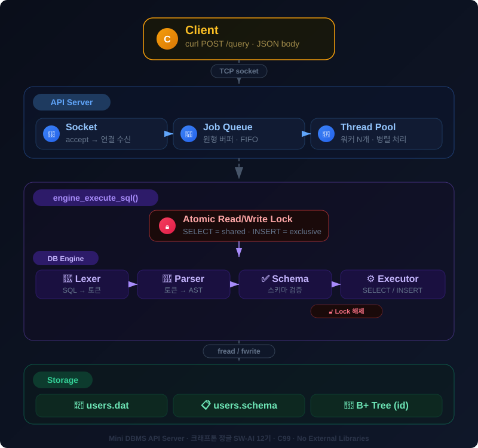

# 🗄️ Mini DBMS API Server

**HTTP로 SQL을 보내면 JSON으로 결과를 돌려주는 미니 데이터베이스 서버**

크래프톤 정글 SW-AI 12기 · CSAPP Chapter 11 네트워크 프로그래밍

`C99` · `Socket` · `Thread Pool` · `B+ Tree` · `Atomic Lock` · **외부 라이브러리 0개**

---

## 개요

C언어로 만든 HTTP 기반 SQL 처리 서버다. 클라이언트가 `curl`로 SQL을 보내면, 서버가 파싱하고 실행해서 JSON으로 응답한다. 소켓, HTTP 파싱, JSON 생성, SQL 엔진, B+ Tree 인덱스, 스레드 풀, Atomic Lock까지 외부 라이브러리 없이 전부 직접 구현했다.

## 아키텍처

  

## 쟁점

